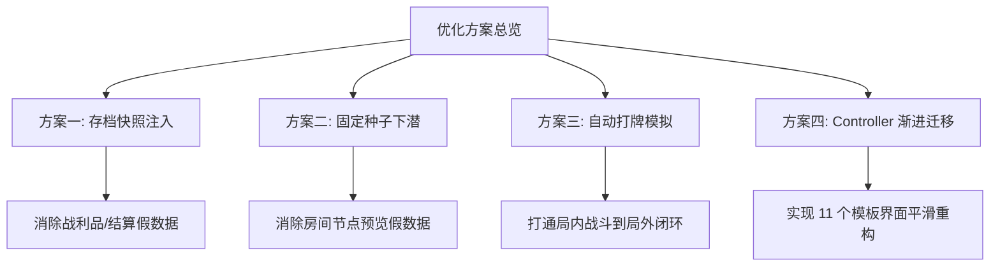
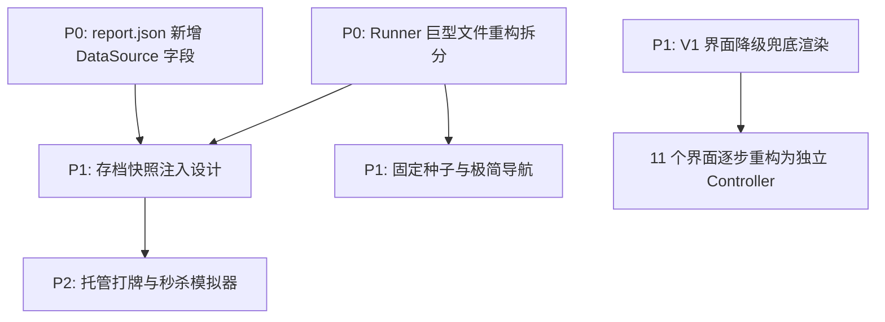

# Project P3 美术自动验收（截图）流程优化与真实数据驱动演进方案

> **定位：** 本文档针对 Project P3 现有的 21 个美术验收（截图）点进行深度评估，剖析“使用验收专用构造数据（假数据）”的技术瓶颈，提出从“假数据 preview”向“真实游戏流驱动”演进的系统化优化方案与平滑迁移路径。
> **核心冲突：** 自动化截图的高效确定性 VS 真实游戏玩法的随机性与状态副作用。

---

## 一、 当前架构现状与分类评估

在 [ArtAcceptanceRunner.cs](file:///f:/design/game/project/p3/UnityClient/Assets/Scripts/ArtAcceptance/ArtAcceptanceRunner.cs) 中，当前 21 个截图点的数据源和驱动机制可以归纳为三类：

### 1.1 截图点分类对比表

| 截图点名称 | 分类 | 当前驱动机制 | 数据真实度 | UI 结构真实度 | 潜在风险 |
|---|---|---|---|---|---|
| `workshop_main` | **A. 真实游戏流** | 调用 `GameFlowController.EnterWorkshop` | 100% | 100% | 无 |
| `dungeon_map` | **A. 真实游戏流** | 真实配置加载地图，等待 `OnLayerLoaded` | 100% | 100% | 地图随种子变化，UI 位置不固定 |
| `combat_hud` | **A. 真实游戏流** | 调用真实 `StartCombat(monsterIDs)` 启动战斗 | 100% | 100% | 依赖配置中存在合法怪物ID |
| `sell_panel` | **A. 真实游戏流** | 调用真实 `OpenSellPanel`，读取背包 | 100% | 100% | 玩家背包为空时显示空白 |
| `prosthetic_panel` | **A. 真实游戏流** | 调用真实 `OpenProstheticPanel`，读取配方 | 100% | 100% | 依赖配方静态配置 |
| `layer_select` | **A. 真实游戏流** | 临时解锁全部层级，打开选择面板后还原 | 100% | 100% | 修改运行时状态，有还原失效隐患 |
| `inventory_loot` | **B. 验收专用构造** | 静态构造 `CombatLootPickupResult` 填入物品 | 30% (假) | 100% | 无法暴露真实结算事件的字段缺失 |
| `settlement` | **B. 验收专用构造** | 静态构造 `DungeonSettlementResult` | 30% (假) | 100% | 结算界面的动态动效在帧末可能未完结 |
| `safe_room` | **B. 验收专用构造** | 静态构造 `SafeRoomNode` 预览对象并切入 | 20% (假) | 100% | 忽略了玩家进入安全屋的实际数值扣减 |
| `stairs_room` | **B. 验收专用构造** | 静态构造 `StairsNode` 预览对象并切入 | 20% (假) | 100% | 忽略了层级跃迁状态机的真实切换逻辑 |
| 11 个 Formal V1 界面 | **C. 模板面板渲染** | V1 Panel 绑定服务读取真实 Snapshot 渲染 | 80% (真数据) | 50% (非正式UI) | 共享一个 template 渲染器，无独立交互逻辑 |

> [!NOTE]
> **说明：** 11 个 Formal V1 界面包括：`maintenance_panel`（机体维护）、`daily_bill_report`（每日账单）、`shop_staging`（筹备期商店）、`order_board`（订单板）、`rumor_board`（传闻板）、`business_settlement`（工坊结算）、`chassis_upgrade_panel`（底盘升级）、`doll_interaction`（魔偶互动）、`doll_room`（魔偶房间）、`faction_shop`（势力商店）、`scenario_event`（剧情事件）。

---

## 二、 真实数据驱动的演进瓶颈分析

为什么目前无法简单地对所有截图点“ 100% 采用真实游戏流驱动”？主要存在以下技术瓶颈：

### 2.1 瓶颈一：结算与战利品界面（Category B）的“非确定性与副作用”
真实的战利品和深渊结算界面，必须在深渊探索中战胜怪物或触发特定事件后才能打开。
- **时间成本极高**：如果每次截图都要跑一段真实的战斗和探索逻辑，即使是由 AI 驱动，由于战斗决策和动画播放，也需要耗费数分钟，这破坏了“无人值守、极速出图”的确定性原则。
- **数据副作用污染**：真实战斗会改变魔偶的 HP、SAN 值、消耗弹药、产生真实掉落金币等。如果把这些副作用写入玩家正式的存档，会导致后续截图的上下文数据处于不可控状态，无法保证每次验收的 baseline 完全一致。
- **视觉校验缺失**：真实的随机掉落难以保证正好生成用于测试 UI 贴边、网格对齐、超长文字换行等极端情况的“代表性物品”（例如需要校验 P0 级 Sliced Sprite 的特制装备）。

### 2.2 瓶颈二：安全屋与阶梯房间（Category B）的“地图随机生成性”
真实的深渊地图是使用伪随机算法生成的。
- 无法保证玩家所处的第一个房间必然是安全屋或阶梯节点。
- Runner 如果要在真实下潜中截图这两个房间，就必须实现一套自动走格子、处理路途事件、判断节点类型的“自动寻路和下潜 AI”。

### 2.3 瓶颈三：Formal V1 模板面板（Category C）的“控制器抽象缺失”
这 11 个面板由 [WorkshopFormalV1PanelBindingService.cs](file:///f:/design/game/project/p3/UnityClient/Assets/Scripts/UI/Workshop/WorkshopFormalV1PanelBindingService.cs) 通过一个通用的 V1 面板控制器渲染。
- 这些系统在底层还没有各自独立的 C# 交互 Controller（如真正的 `MaintenancePanelController` 等）。
- 它们读取的是真实的玩家数据快照，但由于没有独立 Controller，其交互行为和状态流转无法形成闭环。

---

## 三、 四大具体优化方案设计

为了解决上述瓶颈，我们提出以下四大优化方案，逐步剥离假数据，向真实游戏流对齐。



### 3.1 方案一：基于存档快照（SaveState Snapshot）的验收流（P1 级）
**目标**：消除 `inventory_loot` 和 `settlement` 的硬编码假数据，使用真实反序列化对象。

#### 3.1.1 核心思想
不通过打怪触发结算，而是**预先烘焙一个代表性极强的“验收存档快照”**（`acceptance_save_state.json`）。该快照包含：
1. 处于“待领取战利品”挂起状态的 `DungeonContext`。
2. 缓存中存放有 3-4 个故意挑选的、能触发所有 VisualID 校验和超长名称的战利品装备。
3. 包含特定结算类型（胜/败）的 `DungeonSettlementResult` 数据实体。

#### 3.1.2 实现步骤
1. 在 [ArtAcceptanceRunner.cs](file:///f:/design/game/project/p3/UnityClient/Assets/Scripts/ArtAcceptance/ArtAcceptanceRunner.cs) 的 `PrepareGameRuntime` 步骤中，拦截普通存档读取，强行载入该快照：
   ```csharp
   SaveService.LoadSnapshotForAcceptance("acceptance_save_state.json");
   ```
2. 执行 `CaptureInventoryLoot` 时，从真实的全局服务 `GameRoot.Core.Dungeon` 中获取挂起的战利品数据，调用真实的 `CombatLootUIController.Initialize(realLootResult)`。
3. 截图完成后，直接将存档丢弃，不写入本地物理文件，确保 0 副作用。

---

### 3.2 方案二：基于固定种子（Fixed Seed）与极简导航的节点截图（P1 级）
**目标**：消除 `safe_room` 和 `stairs_room` 的预览构造体，直接从真实深渊地图节点渲染。

#### 3.2.1 核心思想
利用深渊地图生成的伪随机种子可控性，使用**验收专用固定种子**，确保起点周围 1 格内必然存在安全屋和阶梯节点。

#### 3.2.2 实现步骤
1. 下潜启动：
   ```csharp
   const int ACCEPTANCE_SEED = 999988; // 确保 1 层地图拓扑已知的固定种子
   GameRoot.Core.Dungeon.StartRunAtLayer(1, seed: ACCEPTANCE_SEED);
   ```
2. 导航与截图：
   - 载入地图后，直接从真实 `DungeonMap` 拓扑中定位 `SafeRoomNode` 坐标。
   - 不再创建假 Node，而是通过测试辅助类模拟玩家点击该节点：
     ```csharp
     DungeonMapUIController.SimulateClickNode(safeRoomNodeId);
     ```
   - 触发真实的 `SafeRoomUIController` 被动响应事件打开面板，渲染并截图。

---

### 3.3 方案三：自动战斗模拟驱动器（Auto-Battle Simulator）（P2 级）
**目标**：打通 `combat_hud` 到结算的“真全链路流”。

#### 3.3.1 核心思想
在验收流程中，通过**托管玩家操作（Auto-Play AI）**和**秒杀辅助**，在 3 秒内结束战斗，并依靠真实事件总线自然流转到结算界面。

#### 3.3.2 实现步骤
1. 进入战斗后，Runner 激活托管 AI：
   ```csharp
   BattleAiDirector.EnableAutoPlay(true);
   ```
2. 验收专属“秒杀”机制：为了防止随机性，Runner 可直接调用后端 API，将敌方卡牌的 HP 扣减至 0。
3. 战斗核心系统向 EventBus 广播 `CombatVictoryEvent`。
4. 游戏框架自动跳转至 `CombatLootUIController`。Runner 监听此跳转事件，停顿 0.2 秒后截图 `inventory_loot.png`，随后自动点击“全部拾取”，无缝切回小镇。

---

### 3.4 方案四：Formal V1 界面向独立 Controller 的平滑迁移机制（P1 级）
**目标**：在重构 11 个 V1 面板期间，保证截图 Runner 编译不中断、截图不报错。

#### 3.4.1 核心思想
采用**“降级兜底渲染（Degraded Fallback）”**模式。当某个界面被赋予了独立 Controller 时，Runner 自动切换到真实 Controller 路径；对于尚未重构的界面，继续通过通用的 `WorkshopFormalV1PanelController` 模板渲染。

#### 3.4.2 代码演进示意
```csharp
private IEnumerator CaptureMaintenancePanel() {
    // 检查是否存在正式的独立交互控制器
    var formalController = FindObjectOfType<MaintenancePanelController>();
    if (formalController != null) {
        // A. 真实游戏流：走独立控制器打开路径
        formalController.OpenMaintenanceView();
        _report.MarkDataSource("maintenance_panel", "real_gameplay");
    } else {
        // B. 兜底策略：使用 V1 模板引擎拼装渲染
        _formalV1PanelController.OpenFormalV1Panel("maintenance_panel");
        _report.MarkDataSource("maintenance_panel", "formal_v1_template");
    }
    yield return WaitForVisualStable();
    CaptureScreen("maintenance_panel");
}
```

---

## 四、 实施优先级与依赖矩阵

由于涉及文件拆分、底层存档接口修改和多个界面的重构，推荐采用分阶段演进方案。

### 4.1 优先级矩阵

| 任务名称 | 优先级 | 依赖项 | 成本估算 | 收益 |
|---|---|---|---|---|
| **P0: 结构解耦**<br>拆分巨型 Runner 文件 | **P0** (必须最先做) | 无 | 1.5 天 | 极大地降低后续演进导致的基础截图框架崩溃风险，支持 partial class 多人协作。 |
| **P0: 透明化**<br>标记 `DataSource` 字段 | **P0** | 无 | 0.5 天 | 避免美术和 agent 误判模板截图为功能完成，实现开发进度的准确度量。 |
| **P1: 数据真实化**<br>引入存档快照加载 | **P1** | P0 结构解耦 | 2 天 | 彻底解决 `settlement` 和 `inventory_loot` 的数据伪造问题，打通 UI 数据层。 |
| **P1: 节点真实化**<br>固定深渊种子导航 | **P1** | P0 结构解耦 | 2.5 天 | 解决安全屋和阶梯房间的预览假对象问题，跑通局内节点 UI 绑定。 |
| **P1: 架构重构**<br>V1 降级兜底机制 | **P1** | 无 | 1.5 天 | 保证 11 个纵切系统在独立重构过程中，美术验收截图流水线依然稳定可运行。 |
| **P2: 全闭环**<br>自动打牌与秒杀器 | **P2** | 方案一存档快照 | 3 天 | 形成局内到局外真正的交互闭环测试，实现真正的 UI 集成自动化。 |

### 4.2 依赖拓扑图



---

## 五、 风险评估与应对策略

| 潜在风险 | 影响范围 | 严重程度 | 应对策略 |
|---|---|---|---|
| **快照存档版本过期** | 方案一：存档快照 | **高** (导致反序列化失败崩溃) | 将验收用的 `acceptance_save_state.json` 纳入 `Sync-Configs.ps1` 和 Config Validator 自动稽核流程。一旦后端 Schema 改变，立即在编译期报编译警告，并提供一键重新导出快照的编辑器工具。 |
| **自动导航死循环/卡死** | 方案二：下潜导航 | **中** (导致机器人流水线挂起) | 在 Runner 中实施强硬的协程超时熔断机制。每个 Step 最长限时 8 秒。超时自动记录“TIMED_OUT”错误报告，dump 内存 UI 树，并强行关闭 Play Mode 退出，防止挂起 agent。 |
| **路径硬编码失效** | 方案四：独立控制器重构 | **中** (导致 UI Check 扫描报错) | 在 `ApplyRequiredUiChecksToCapture` 中使用宽松的“警告”而非“错误”判定。对于更变了路径的 UI 节点，仅报 `WARNING`，不中断截图导出，提示程序和美术补齐契约同步。 |

---

## 六、 渐进式迁移路径 (从假到真的 5 步走)

### 3.1 第一阶段：解耦与透明化 (本周内)
1. **Runner 文件重构**：将 [ArtAcceptanceRunner.cs](file:///f:/design/game/project/p3/UnityClient/Assets/Scripts/ArtAcceptance/ArtAcceptanceRunner.cs) 拆分为：
   - `ArtAcceptanceRunner.cs`（总流程控制）
   - `ArtAcceptanceCaptureSteps.cs`（分步骤 Capture 实现）
   - `ArtAcceptancePayloadFactory.cs`（假数据/存档构造工厂）
2. **DataSource 字段落地**：在 `report.json` 中标记每个截图是假数据预览还是真游戏流，并在 [09_运行时美术验收记录.md](file:///f:/design/game/project/p3/美术文档/09_运行时美术验收记录.md) 中建立分类台账。

### 3.2 第二阶段：静态真实化 (1-2 周)
1. 设计并放置 `acceptance_save_state.json`。
2. 重构 `CaptureInventoryLoot` 和 `CaptureSettlement`，通过存档注入，让其初始化时调用真实的 UI Controller。

### 3.3 第三阶段：局部动态真实化 (2-3 周)
1. 落地 `ACCEPTANCE_SEED` 固定种子生成器。
2. 重构安全屋和阶梯节点的截图，通过模拟点击事件打开真实 UI，丢弃预览假 Node。

### 3.4 第四阶段：全链路流式打通 (长期伴随)
1. 伴随 11 个 Formal V1 面板的程序纵切推进，每完成一个界面的独立 Controller，就将其迁移至“真实游戏流”截图模式，并移除对应的降级兜底 V1 拼装代码。
2. 引入托管自动战斗 AI 与秒杀指令，串联起深渊下潜 → 自动寻路 → 战斗 → 极速秒杀 → 战利品拾取 → 结算回小镇的无缝交互。

### 3.5 第五阶段：回归比较自动化
1. 落地 `history/` 留档机制。
2. 美术 agent 和程序在每次资源替换或功能提交时，通过像素 Diff 自动生成前后画面对比报告，实现真正的“视觉回归保护”。
